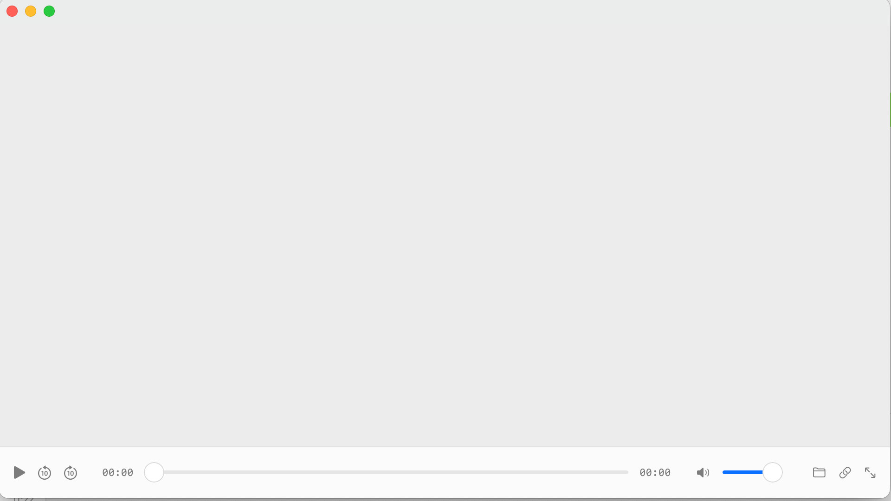

# PlayerKit

A protocol-oriented, FFmpeg + VideoToolbox + Metal media player SDK for Apple platforms (macOS / iOS / tvOS).

PlayerKit gives you a production-grade playback pipeline — native hardware decoding, A/V sync, HDR → SDR tone-mapping — behind a clean protocol surface. Bring your own renderer, audio output, or frame sink by conforming to a protocol. No lock-in, no global state.



## Features

- **Protocol-oriented core** — `Playable` / `MediaProbable` / `VideoRenderer` / `AudioOutputBackend` / `FrameSink` / `PlayerBackend`. Replace any piece by conforming to a protocol.
- **Native hardware decoding** — VideoToolbox (VT) for H.264 / HEVC, FFmpeg software decoder as fallback for other codecs. Audio is decoded via FFmpeg (AAC, Opus, AC3, EAC3, DTS, FLAC, ...).
- **A/V sync** — AudioClock-driven master clock, VideoJitterBuffer (PTS-ordered), SyncController, PTSValidator. Tuned for variable-frame-rate and seek-resume.
- **HDR → SDR tone-mapping** — BT.2390 EETF for PQ/HLG inputs, BT.2020 → BT.709 gamut conversion. Runs in a Metal compute shader (`Shaders.metal::hdr_to_sdr`).
- **FFmpeg bundled** — 5 xcframeworks (libavcodec/libavformat/libavutil/libswresample/libswscale). On the refluxio/PlayerKit independent repo they are committed; in the reflux main repo they are git-ignored and regenerated by `scripts/build_ffmpeg.sh`.
- **Open Core** — base player is open-source (LGPL v2.1+). Advanced HDR passthrough, Atmos/DTS-HD passthrough, DLNA cast, AI frame sampling are available in the closed-source `PlayerKitPro` module, injected via the same protocols.

## Requirements

- macOS 14.0+ / iOS 17.0+ / tvOS 17.0+
- Xcode 16+
- Swift 5.9+

## Quick Start

```swift
import SwiftUI
import PlayerKit
import PlayerKitNative

struct ContentView: View {
    @State private var player: Player?

    var body: some View {
        ZStack {
            if let player {
                PlayerNativeView(player: player)
            } else {
                Color.black
            }
        }
        .task {
            do {
                let backend = try NativeBackend()
                player = Player(backend: backend)
                player?.play(url: URL(string: "https://example.com/movie.mkv")!)
            } catch {
                print("init failed: \(error)")
            }
        }
    }
}
```

`NativeBackend()` defaults to a SDR `MetalRenderer` + `AudioUnitOutput` (PCM). For HDR inputs, the renderer tone-maps to SDR automatically. Playback state (`isPlaying` / `position` / `duration` / `error` / ...) is observable via `player.state` — bind your UI to it directly.

## Installation

### Swift Package Manager

```swift
dependencies: [
    .package(url: "https://github.com/refluxio/PlayerKit.git", from: "0.1.0"),
]
```

```swift
.target(name: "YourApp", dependencies: [
    .product(name: "PlayerKit", package: "PlayerKit"),
    .product(name: "PlayerKitNative", package: "PlayerKit"),
])
```

FFmpeg xcframeworks are committed to the `refluxio/PlayerKit` repository
when obtained from there. When developing inside the reflux monorepo, the
xcframeworks are git-ignored — run `scripts/build_ffmpeg.sh` once after
cloning to generate them locally.

## Examples

See [`Examples/MinimalPlayer/`](Examples/MinimalPlayer/) — a macOS demo app with file open panel, URL overlay, play/pause, seek bar, volume, fullscreen, and an error overlay with copy-to-clipboard. It demonstrates the typical SwiftUI integration shape (`PlayerNativeView` + `Player.state` binding).

```bash
cd Examples/MinimalPlayer
xcrun swift run
```

> The `swift run` binary alone won't activate the AppKit GUI — bundle it into a `.app` and `open` it. See [`CONTRIBUTING.md`](CONTRIBUTING.md) for the exact steps.

## Architecture

```
┌─────────────────────────────────────────────────┐
│  Your App                                       │
│  ┌──────────────────────────────────────────┐  │
│  │  Player (facade)                         │  │
│  │  └─ PlayerBackend (protocol)             │  │
│  │     ├─ VideoRenderer (protocol)          │  │
│  │     ├─ AudioOutputBackend (protocol)     │  │
│  │     └─ [FrameSink] (protocol)            │  │
│  └──────────────────────────────────────────┘  │
│                                                 │
│  Default implementations (PlayerKitNative):     │
│  ┌──────────────────────────────────────────┐  │
│  │  NativeBackend                           │  │
│  │  ├─ MetalRenderer  : VideoRenderer       │  │
│  │  ├─ AudioUnitOutput: AudioOutputBackend  │  │
│  │  ├─ FFmpegDemuxer                        │  │
│  │  ├─ VTVideoDecoder / FFmpegVideoDecoder  │  │
│  │  └─ SyncController / AudioClock / ...    │  │
│  └──────────────────────────────────────────┘  │
└─────────────────────────────────────────────────┘
```

### Open Core boundary

The open-source `PlayerKit` + `PlayerKitNative` targets cover:

- Protocol layer (`Playable` / `MediaProbable` / `FrameSink` / `VideoRenderer` / `AudioOutputBackend` / `PlayerBackend`)
- `NativeBackend` (VT hardware decode + FFmpeg software decode + Metal SDR rendering + A/V sync + basic HDR → SDR tone-mapping)

The closed-source `PlayerKitPro` module provides:

- `EDRRenderer` — HDR passthrough to EDR/HDR displays (no tone-mapping)
- `PassthroughOutput` — Atmos / DTS-HD compressed audio passthrough (AC3/EAC3/DTS)
- `DLNAFrameSink` — cast to DLNA renderer devices
- `AIFrameSampler` — sample frames for OCR / scene detection / subtitle translation
- Dolby Vision tone-mapping (profile 5/8)

`PlayerKitPro` is injected via the same protocols — the open-source layer has no knowledge of `PlayerKitPro`:

```swift
import PlayerKit
import PlayerKitNative
import PlayerKitPro  // closed-source

let backend = try NativeBackend(
    renderer: EDRRenderer(),           // PRO
    audioOutput: PassthroughOutput()  // PRO
)
let player = Player(backend: backend)
player.addFrameSink(DLNAFrameSink(target: device))  // PRO
```

## License

PlayerKit is licensed under **LGPL v2.1+**. See [`LICENSE`](LICENSE) and [`NOTICE`](NOTICE).

PlayerKit links FFmpeg (LGPL v2.1+). Users may replace the FFmpeg xcframeworks to satisfy LGPL requirements — see [`NOTICE`](NOTICE) for instructions.

## Contributing

See [`CONTRIBUTING.md`](CONTRIBUTING.md). Signed commits (`git commit -s`) required.
